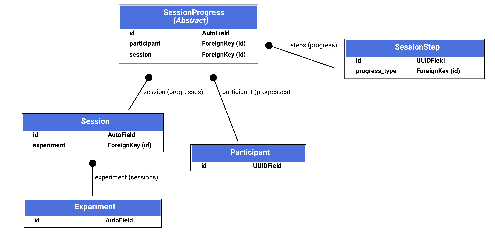
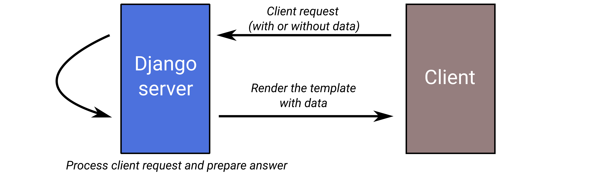
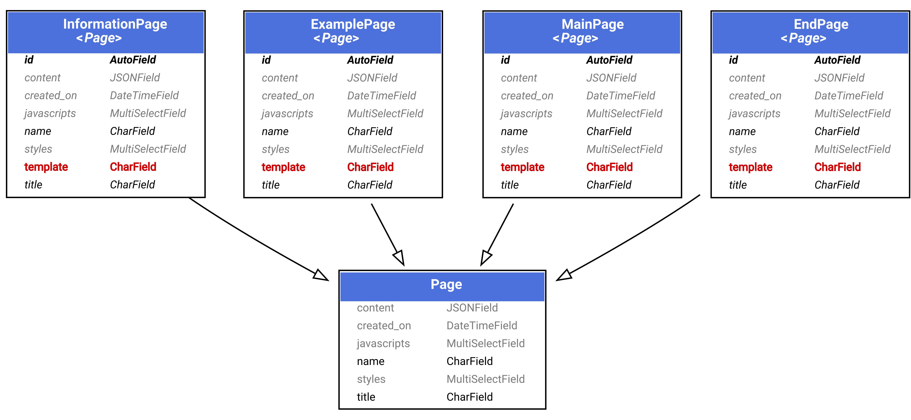
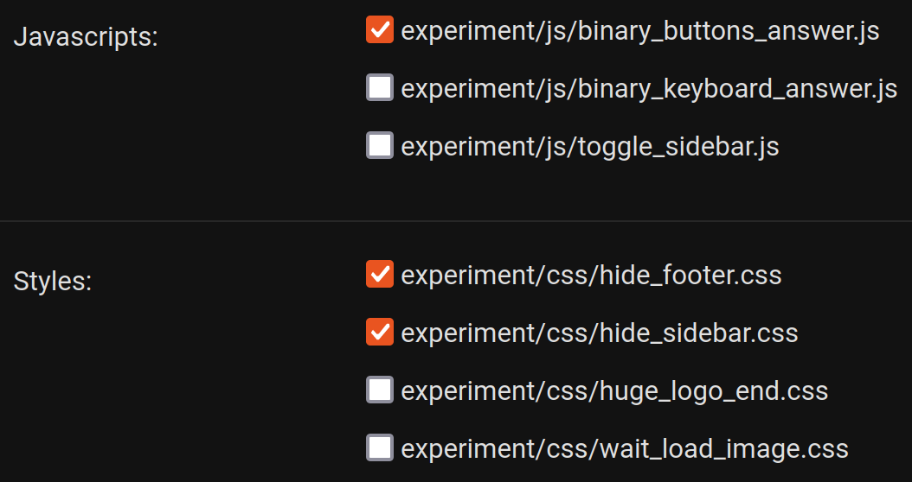
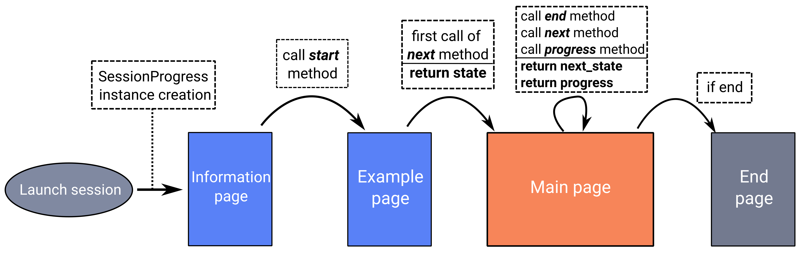

======================================
A tour of Behavioral online experiment
======================================

This documentation will allow you to get to know the framework and the administrator interface. It will detail the concepts and the idea behind the abstraction for the creation of online experiments.

.. note:: 
    It is highly recommended to read this documentation in parallel with the administrator interface (which is available at ``http://127.0.0.1:8000/admin``, more specifically for the management of experiments in ``http://127.0.0.1:8000/admin/experiments``).

In order to fully understand how the interface of the proposed application works, you can run it on example data.

.. code-block:: bash

    cp db.example.sqlite3 db.sqlite3

.. note::
    
    The website will now be composed of a set of example data.

You can log in to the administrator interface with the following credentials: 

.. code-block:: bash

    username: adminuser
    password: adminuser

Main concepts
=============

This is a main overview of the important components of the framework:

Here a description of each principal components:

- **Experiment:** represents the architecture of the experiment with the associated pages (more details will be provided later), a JSON configuration of the experiment (path to data for example), a description and an availability status;
- **Session:** an experience can be attached to several sessions. Indeed, it can be wished that the experiment is available for different populations and/or that the stopping criterion of the experiment is different (time of the experiment). A JSON configuration is associated to a session and it also has an availability status (can also be active or not);
- **SessionProgress:** is one of the most important entities, it is at the heart of the application's operation. It allows the link between a session and a participant. When a participant wants to perform an experiment through a session, a new SessionProgress instance is created. This instance will manage the exchanges with the user, transmit the next stimulus to the user and define the stop of the experiment according to the stop criteria specified in the session. A SessionProgress, contains several SessionSteps, which store the user's response for each new stimulus transmitted.

With this insight, we will now go into more detail to understand how to create your own experience

Notion of template
==================

First, we need to take a look at a very important concept of Django: the notion of ``template``. A **template** is an html page with a particular way of displaying data sent from the Django server. This is a common way in order to display data to the client in Django.

The following figure describe the process:

Here is an example of how Django works: 

.. code-block:: python
    
    def render_template_with_data(request):
        """
        Route available at `/experiment`
        Choose template and returns expected data
        """

        data = {
            "experiment": "My experiment title"
        }

        return render(request, "templates/experiment.html", data)

The template code example:

.. code-block:: html

    ...
    <!-- displays return data using key -->
    <h3>{{ experiment }}</h3>
    ...

.. note::

    Don't worry, you won't need to create Django queries, however, you will create templates if needed to specify the display you want.

Experiments
===========

The introduction to templates is important because we have mentioned in the main concepts that an experiment is composed of pages.

Experiment process
~~~~~~~~~~~~~~~~~~

Indeed, an experiment is composed of 4 pages:

- **The information page:** it may be necessary to ask some information from the participant, or to inform him about certain aspects of the experience. This is what the hint page allows;
- **The example page:** which provides instructions for a good understanding of the participating experience. It can be visible without going through the experience;
- **The main page:** this is where the experience will unfold, it will receive the new stimulus at each step, and will ask the participant to respond accordingly;
- **The end page:** when the SessionProgress instance determines the end of the participant's experience session, the end page is proposed to the participant.

.. note::
    Each page is composed of a name and a title, the name is used to identify the page on the admin interface side, the title is used on the client side.

Page creation
~~~~~~~~~~~~~

It is possible to create a particular page from the administrator interface (``http://127.0.0.1:8000/admin/experiments``). Each page requires a particular template and can be selected at creation. Each variable entered in the page configuration can be displayed in a particular template.

.. warning::

    In order for an experiment to be created, it must be associated with each of the requested pages (information, example, main and end).

The folder ``experiments/templates/pages`` contains all the Django templates currently available for pages. Each sub-folder: ``end``, ``examples``, ``information``, ``main`` is associated with a particular type of page. This is how the *admin* interface provides you with only the possible templates.

The structure of a page template for Django is as follows:

.. code::

    

    
    

    
        <h1>Your specific page</h1>
    

.. warning::

    For a new template to be taken into account in the administrator interface, the server must be restarted.

Associate styles and Javascript 
~~~~~~~~~~~~~~~~~~~~~~~~~~~~~~~

When you have access to the creation url to add a page (``http://127.0.0.1:8000/admin/experiments/mainpage/add/``), it is possible to specify its content, its template, but also the style and javascript files that will be loaded for this page:

In this way, as illustrated, it is possible to select several style and javascript files which will be loaded for the page.

It is possible to add as many style scripts and javascripts as necessary in the folder: ``static/experiment`` of the project.

.. warning::

    For a new style or javascript file to be taken into account in the administrator interface, the server must be restarted.

Page data access into template
~~~~~~~~~~~~~~~~~~~~~~~~~~~~~~

A JSON field is configurable when you create or modify your page. It allows to store some static data. This JSON configuration is accessible from your template thanks to the Django ``page`` object, and more specifically the ``content`` field of the ``page`` instance.

This is a JSON configuration example:

.. code:: json

    {
        "description": "My first example page",
        "params" : {
            "number_of_questions": 10,
            "expected_time": 20
        }
    }

with its template data access:

.. code:: html

    
        

            <!-- Page Heading -->
            

                <h5>{{page.content | from_json:"description"}}</h5>
            

            

                <!-- Keep in this scope a new `params_obj` object which stores `params` JSON field data -->
                
                    
Number of questions: {{params_obj | from_json:"number_of_questions"}}

                    
Expected time: {{params_obj | from_json:"expected_time"}} minutes

                
            

        

    

.. note::
    At the end of this tutorial, a summary of the data accessible by type of page will be provided.

        
Session
===========

As mentioned, the session is associated with an experiment, i.e. it remains associated with the 4 pages that compose the experiment. The main interest of the Session division is that an experiment can be carried out with different parameters (number of iterations, stopping time criteria) with different populations.

When creating an experiment from the administrator interface (``http://127.0.0.1:8000/admin/experiments/session/add/``), it is possible to associate it with the desired experiment, propose a specific configuration, an estimated duration and a very important item, the way the experiment progresses: a specific ``SessionProgress`` model.

.. note::
    We'll get into the details of SessionProgress model next.

For now, let's focus on the fact that the current configuration of our session is as follows:

.. code:: json

    {
        "max_iterations": 20
    }

We will use this configuration to specify that the participant will be confronted with a maximum of 20 stimili (i.e. 20 iterations).

Session Progress principle
==========================

For the moment, it is not possible to create our ``Session``, as it lacks the essential component for the proper functioning of the planned experiment: a ``SessionProgress`` model. There are a few examples of this model in the ``experiments/experiments`` folder, but here we will describe how it works.

The representation of a SessionProgress
~~~~~~~~~~~~~~~~~~~~~~~~~~~~~~~~~~~~~~~

A SessionProgress is composed of 4 main methods as detailed below:

.. code:: python

    class SessionProgress():

        @abstractmethod
        def start(self, participant_data):
            """
            Define and init some progress variables
            """
            pass

        @abstractmethod
        def next(self, step, answer) -> dict:
            """
            Define next step data object taking into account current step and answer

            Return: JSON data object
            """
            pass

        @abstractmethod
        def progress(self) -> float:
            """
            Define the percent progress of the experiment

            Return: float progress between [0, 100]
            """
            pass

        @abstractmethod
        def end(self) -> bool:
            """
            Check whether it's the end or not of the experiment

            Return: bool
            """
            pass

The figure below details where the methods of the SessionProgress instance are realized:

Additional information is provided below to help you understand the proposed scheme:

- First, the specific instance of ``SessionProgress`` is created when the experiment session is launched;
- Once the information page is validated by the participant, the ``start`` method is called to retrieve the entered information;
- The example page is then presented;
- Once the instructions have been validated, the first stimulus is proposed to the participant (first call of the method ``next``);
- Then, as long as the ``end`` method does not determine that the experiment is finished, a new stimulus (obtained from a new call ``next`` method) is proposed to the participant on the main page of the experiment. The progress indicator of the experiment (``progress`` method) is also transmitted to the template of the main page;
- Finally, if the ``end`` method specifies an end of experiment, the participant is redirected to the end of experiment page.

Summary of data access from pages
~~~~~~~~~~~~~~~~~~~~~~~~~~~~~~~~~

Before presenting a concrete example of an experiment implementation, let's specify which variables are accessible on each of the 4 possible pages:

- **Information, Example, and End pages:**

    - **page**: the current information page instance;
    - **experiment**: the current selected experiment;
    - **progress**: the current SessionProgress instance;
    - **session**: the selected session.

- **Main page:**

    - **page**: the current information page instance;
    - **experiment**: the current selected experiment;
    - **progress**: the current SessionProgress instance;
    - **session**: the selected session;
    - **progress_info**: the computed progress percent from the ``result`` method of SessionProgress;
    - **step**: the specific SessionStep data (stimilus data).

Custom SessionProgress
============================

Now that the concept of the progression of an experiment has been explained, let's look technically at how each method works. We will create a class called ``ClassicalSessionProgress`` which inherits the attributes and behaviors of ``SessionProgress``. In this new class, we will define the 4 necessary methods: start, next, progress and end.

.. code:: python

    from ..models import SessionProgress

    class ClassicalSessionProgress(SessionProgress):
        pass

Start method
~~~~~~~~~~~~

Let's start with the following example of the information page:

.. code:: html

    <!-- Page Heading -->
    

        <h5>{{page.content|from_json:"question"}}</h5>
    

    

        <form method="post" class="col-xs-6 col-md-offset-3" action="">  
            
            

                <label for="basic-select-glasses" class="form-label">Do you wear glasses?</label>
                <select name="basic-info-glasses" id="basic-select-glasses" class="form-control" aria-label="Default select example">
                    <option value="0" selected>No</option>
                    <option value="1">Yes</option>
                </select>
            

            

                <button type="submit" class="btn btn-primary mb-3">Start experiment</button>
            

        </form> 
    
 

.. note::

    - ````: avoid the CSRF vulnerability;
    - ```` enables to redirect to the example page with the three specific parameters (experiment, session and progress identifiers).

This information page contains a POST form and sends data about the participant (here the information of the wearing of glasses or not). The ``start`` method of SessionProgress retrieves a parameter that stores all this data.

This data can be processed and saved in the JSON field ``data`` of the SessionProgress instance:

.. code:: python

    def start(self, participant_data):

        # need to be initialized in order to start experiment
        if self.data is None:
            self.data = {}

        # keep in memory number of iteration
        self.data['iteration'] = 0
        self.data['participant'] = {
            'glasses': participant_data['basic-info-glasses']
        }

        # always save state
        self.save()

Note that in this example, we also initialize in the SessionProgress data an indicator of the number of iterations performed, initially set to 0.

.. warning::

    Django uses a database to store information about the different models it manages. The ``save`` method, allows to specify a persistence of these data. It is important to use it at the end of the method.

Next method
~~~~~~~~~~~

Once the SessionProgress instance is initialized, it is possible to predict which stimulus can be returned according to different criteria. Here, to simplify the example, we use a random stimuli.

Let's use a main page with the following response form at each step of the experiment:

.. code:: html

    <form class="binary-answer-form" method="post" class="col-xs-6 col-md-offset-3" action="">  
        
        <input type="hidden" name="binary-answer-time"/>
        <input type="hidden" name="binary-answer-value"/>
        
        

            

                <button type="submit" class="btn btn-danger btn-icon-split" value="0">
                    
                        <i class="fas fa-times-circle"></i>
                    
                    No identicals
                </button>
            

            

                <button type="submit" class="btn btn-success btn-icon-split" value="1">
                    
                        <i class="fas fa-check"></i>
                    
                    Identicals
                </button>
            

        

    
    </form> 

As it stands, the response and time fields have no value. It is a preference, because we want to get the exact response time. For that, we rely on javascript which will capture the response time and transmit it before sending (this is a proposal, there may be others):

.. code:: javascript

    document.addEventListener('DOMContentLoaded',() => {

        // keep track of start step time (once document is loaded)
        start_answer_time = Date.now();

        // manage the current form in order to store answer and time
        document.querySelector('form[class="binary-answer-form"]').onsubmit = (e) => {	
            
            e.preventDefault();

            // get answer from button
            let answer_value = document.activeElement['value']

            // Compute time and add it into form
            let answer_time = Date.now() - start_answer_time

            // set specific input values before sending data
            document.querySelector('input[name="binary-answer-time"]').value = answer_time
            document.querySelector('input[name="binary-answer-value"]').value = answer_value
            
            // then submit form
            form = e.target;
            form.submit();
        } 
    });

The ``next`` method of SessionProgress is the most important, because it takes into account how the next stimilus will be presented, but also the update of the previous stimilus. The ``step`` and ``answer`` parameters provide this information:

.. code:: python

    from django.conf import settings

    ...

    def next(self, step, answer) -> dict:
       
        # 1. update previous step depending of answer (if previous step exists)
        if step is not None:
            answer_time = answer['binary-answer-time']
            answer_value = answer['binary-answer-value']
            
            step.data['answer_time'] = answer_time
            step.data['answer_value'] = answer_value
            step.save()
        
        # 2. process next step data (can be depending of answer)

        # folder of images could also stored into experiment config
        cornel_box_path = 'resources/images/cornel_box'
        # need to take care of static media folder
        images_path = sorted([ 
                    os.path.join(cornel_box_path, img) 
                    for img in os.listdir(os.path.join(settings.RELATIVE_STATIC_URL, cornel_box_path)) 
                ])

        # right image always display reference
        # prepare next step data
        step_data = {
            "left_image": {
                "src": f"{random.choice(images_path)}",
                "width": 500,
                "height": 500
            },
            "right_image": {
                "src": f"{images_path[-1]}",
                "width": 500,
                "height": 500
            }
        }

        # increment iteration into progress data
        self.data['iteration'] += 1

        # always save state
        self.save()

        return step_data

Let's summarize what is done:

- A call to the ``next`` method has been made and stimulus data has been prepared. Only the data is prepared because there is no previous step and response (first call to the step method);
- The number of iteration is then increased by one;
- A form on the main page is available to answer the presented stimulus (here a binary answer);
- The use of Javascript allows to recover a reliable response time: time between the presentation of the stimulus and the response (click on a response button);
- The old state and the response information are passed to the ``next`` method. It is thus possible to update the responses obtained in the previous state (SessionStep);
- Finally, the new stimulus is prepared to transmit the information to the template and the current number of iteration is increment.

.. note::

    Note that just like the SessionProgress, a SessionStep has a JSON ``data`` field to store the iteration information (response information and presented data). Note that the next stimulus information, by default, is stored when the next SessionStep is created.

.. warning:: 

    The path where the images are stored (`static` folder), must not be specified for the image to be loaded in the template. It should be used to retrieve information (``settings.RELATIVE_STATIC_URL``), but not specified in the data send.

Progress method
~~~~~~~~~~~~~~~

The progress method is fairly simple, but provides a clear understanding of the relationship between the SessionProgress and its associated Session. The purpose of this method is to return an indicator of the percentage of progress of the experience:

.. code:: python

    def progress(self) -> float:
        
        # access of session's config from current SessionProgress instance
        total_iterations = int(self.session.config['max_iterations'])
        iteration = int(self.data['iteration'])

        # return percent of session advancement
        return (iteration / total_iterations) * 100

Since there is a relationship between our SessionProgress and the Session it is associated with, it is possible to retrieve the session configuration and therefore the ``max_iterations`` we defined earlier.

End method
~~~~~~~~~~~

As you have guessed, the ``end`` method is not the most complicated one. In this example, we will check the number of iterations and specify if the experiment is finished or not:

.. code:: python

    def end(self) -> bool:

        total_iterations = int(self.session.config['max_iterations'])
        iteration = int(self.data['iteration'])

        return iteration >= total_iterations

This is of course only an example, but it is totally possible to save a time when the SessionProgress is created (``start`` method) and verify it. In this case, the duration of the experiment is not targeted on a number of iterations, but rather a temporal duration.

.. warning::

    When the server starts, it will retrieve all the specific models of the ``SessionProgress`` abstract model and propose them for the creation of a ``Session``. For any new creation of ``SessionProgress`` Model, the server must be restarted.

Other examples
~~~~~~~~~~~~~~

Other examples of experiences are available within the project: examples_.

.. _examples: https://github.com/prise-3d/behavioral-online-experiment/tree/master/experiments/experiments