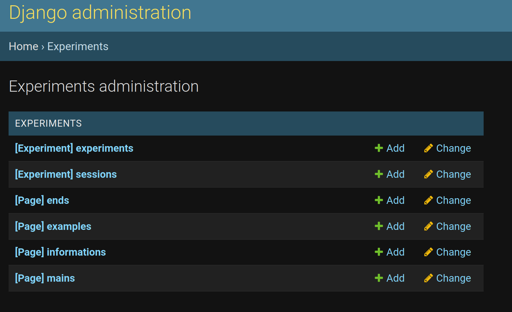
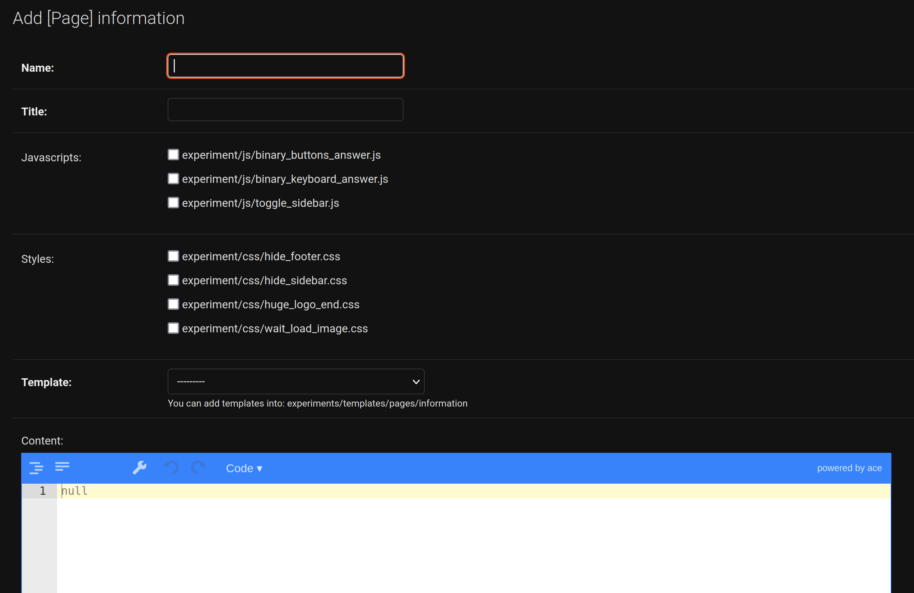
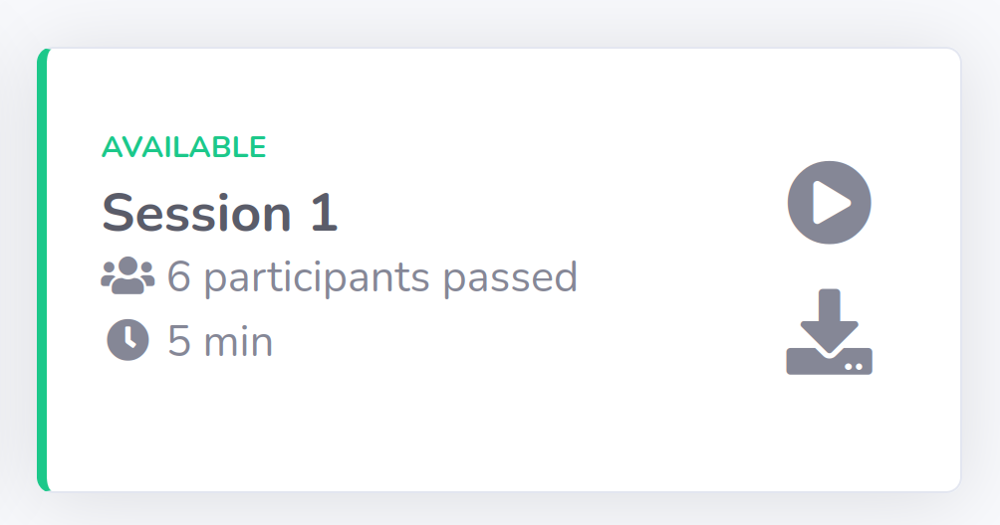

=================================
Create an experiment from scratch
=================================

The example presented allows you to create an experiment from scratch. However, for specific information needs, it may be necessary to refer to the page "A tour of behavioral online experiment" in the section in question.

1. Create an experiment entity
==============================

An experiment is composed of 4 pages : information, example, main and end. The administrator interface allows you to create each page, but it will be necessary for each page to associate Django template and CSS and Javascript styles. 

Here are the different creation steps:

- Create the 4 pages of the experiment: information, example, main and end.
- modify for each page (if necessary) an associated template : experiments/templates/pages
- Once a template is defined: create for each page, its entity in the admin interface with the desired template.
- Then, create the experiment from the 4 pages.

For this, for the edition of the code, it is recommended to open the behavioral-online-experiment folder in folder mode (for example with Visual Studio Code or another code editor).

We start on the web administrator interface: ``http://127.0.0.1:8000/admin/experiments/``

1.1. Information Page
~~~~~~~~~~~~~~~~~~~~~

We will start by creating the page for entering information to the user. To do this:
   
- in the Django Administration interface, use the ``+Add`` of information;

You will now be redirected to this form:

- fill in the different fields of your page, like the name "Ponzon Illusion" and the title "ponzon_illusion". The name identifies the page in the administrator interface, the title will be used in the URL;

- Then you have to select the javascripts and styles files. For this example, we select only ``toggle_sidebar.js`` (the styles and javascript files are available in the project in the folder: ``static/experiment``, but it is not necessary to modify them right away);

- A selection field allows to choose the template of our choice. By default, there is only one: ``basic_information.html``, available in the ``experiments/templates/pages/information`` folder; 

- A JSON field is also available, it allows to specify the content that will be available in the Django template. For this page, it will only contain a sentence inviting the user to enter a data form:

.. code:: json   

    {
      "question": "Please fill the form below:"
    }

It is in this HTML template that the JSON field information will be displayed (this one uses only the question field):

.. code:: html

        ...
        <!-- Page Heading -->
        

            <h5>{{page.content|from_json:"question"}}</h5>
        

        ...

If you create your own templates, you can declare JSON fields that can be processed in the template.

At the end click on ``SAVE``.

1.2. Example page
~~~~~~~~~~~~~~~~~

In the admin interface use ``+Add`` for examples pages, we find the same information to fill in:

- the name field to "Ponzo Example";
- the title field to "ponzo_example"; 
- the field Javascript: none selected;
- the field styles selecting: ``hide_footer.css`` and ``hide_sidebar.css``;
- the template field: ``experiments/templates/pages/examples/one_image.html``.

The JSON content field is composed of:

.. code:: json

    {
      "question": "Are the two segment equals?",
      "description": "Press the LEFT button if you think the segment are equals, or the RIGHT button if you think they are differents.",
      "answer": "The correct answer is yes!",
      "image": {
        "src": "resources/images/ponzo/ponzo10.png",
        "width": 500,
        "height": 500
      }
    }

At the end click on ``SAVE``.

1.3. Main Page
~~~~~~~~~~~~~~

In the admin interface use ``+Add`` for mains pages, we find the same information to fill in:

- the name field to "Ponzo Main";
- the title field to "ponzo_main"; 
- the field Javascript: ``js/binary_buttons_answer.js``;
- the field styles selecting: ``hide_footer.css`` and ``hide_sidebar.css``;
- the template field: ``experiments/templates/pages/main/one_image_buttons.html``.

The JSON field to:

.. code:: json

    {
      "question": "Are the two segment equals?",
      "description": "Press the LEFT button if you think the segment are equals, or the RIGHT button if you think they are differents."
    }

.. note::

    An image will be loaded in the main page, but we will see later that its loading is dynamic.

1.4. End Page
~~~~~~~~~~~~~

In the admin interface use ``+Add`` for mains pages, we find the same information to fill in:

- the name field to "Ponzo End";
- the title field to "ponzo_end"; 
- the field Javascript: ``toggle_sidebar.js``;
- the field styles selecting: none selected;
- the template field: ``experiments/templates/pages/end/basic_end.html``.

And the JSON field to:

.. code:: json

    {
      "end_text": "The experiment is now finished.",
      "thanks_text": "Thanks for your participation!"
    }

Then click on ``SAVE`` button.

1.5. Experiment creation
~~~~~~~~~~~~~~~~~~~~~~~~

In the admin interface use ``+Add`` for experiments, you can fill in the different fields as below:

- the title field to "Ponzo experiment";
- the name field to "Ponzo experiment";
- for each page field, select the new associated created page;
- add the following description of the experiment:

.. code:: text

    Ponzo experiment proposes an image and ask if the segment are equals or not inside this image

- set it as available;
- let the JSON config as empty;

Then click on ``SAVE`` in order to create the experiment.

2. Create a Session Progress class
==================================

As a reminder, a SessionProgress is composed of 4 main methods as detailed below:

.. code:: python

    class SessionProgress():

        @abstractmethod
        def start(self, participant_data):
            """
            Define and init some progress variables
            """
            pass

        @abstractmethod
        def next(self, step, answer) -> dict:
            """
            Define next step data object taking into account current step and answer

            Return: JSON data object
            """
            pass

        @abstractmethod
        def progress(self) -> float:
            """
            Define the percent progress of the experiment

            Return: float progress between [0, 100]
            """
            pass

        @abstractmethod
        def end(self) -> bool:
            """
            Check whether it's the end or not of the experiment

            Return: bool
            """
            pass

The figure below details where the methods of the SessionProgress instance are realized:

.. image:: _static/documentation/global_scheme.png
   :width: 95%
   :align: center

In the ``experiments/experiments`` folder of the projet create a ``ponzo.py`` python file.

.. code:: python

    from ..models import SessionProgress

    class PonzoSessionProgress(SessionProgress):
        ...

.. note::

    A SessionProgress is also composed of a field ``data`` which is a JSON field. We can into this field store some participant information.

We will now define each required method for our new ``PonzoSessionProgress``.

2.1. The start method
~~~~~~~~~~~~~~~~~~~~~

The start method can be composed of:

- ``data`` field initialization;
- start indicator (here number of iteration);
- retrieve data from the information form (present in the information page);
- ``save`` call in order to save data instance inside the database.

.. code:: python
    
    def start(self, participant_data):

        # need to be initialized in order to start experiment
        if self.data is None:
            self.data = {}

        self.data['iteration'] = 0
        self.data['participant'] = {
            'know-cg': participant_data['basic-info-know-cg'],
            'why': participant_data['basic-info-why'],
            'glasses': participant_data['basic-info-glasses'],
        }

        # always save state
        self.save()

Note that in this example, we initialize in the SessionProgress data instance an indicator of the number of iterations performed, initially set to 0.

2.2. Next method
~~~~~~~~~~~~~~~~

The start method should be composed of:

- management of previous step (if exists) and its retrieve data answer (see the answer form into the main page template);
- process the data for the new step (here we propose a random choice).

.. code:: python

    import os
    import random
    from django.conf import settings

    ...

    def next(self, step, answer) -> dict:
       
        # 1. update previous step depending of answer (if previous step exists)
        if step is not None:
            answer_time = answer['binary-answer-time']
            answer_value = answer['binary-answer-value']
            
            step.data['answer_time'] = answer_time
            step.data['answer_value'] = answer_value
            step.save()
        
        # 2. process next step data (can be depending of answer)

        # folder of images could also stored into experiment config
        ponzo_path = 'resources/images/ponzo'

        # need to take care of static media folder (static folder need to be removed)
        images_path = sorted([ 
                    os.path.join(ponzo_path, img) 
                    for img in os.listdir(os.path.join(settings.RELATIVE_STATIC_URL, ponzo_path)) 
                ])

        # prepare next step data with random image path
        step_data = {
            "image": {
                "src": f"{random.choice(images_path)}",
                "width": 500,
                "height": 500
            }
        }

        # 3. increment iteration into progress data
        self.data['iteration'] += 1

        # always save state
        self.save()

        # return new step data
        return step_data

.. note::

    The data returned from the ``next`` method is then accessible in the main page template from the ``step.data`` field.

2.3. Progress method
~~~~~~~~~~~~~~~~~~~~

A ``SessionProgress`` is always associated with a ``Session``. We can access to this session and its configuration. Let's assume that our session's configuration will have a ``max_iterations`` indicator:

.. code:: python

    def progress(self) -> float:
        
        # access of session's config from current SessionProgress instance
        total_iterations = int(self.session.config['max_iterations'])
        iteration = int(self.data['iteration'])

        # return percent of session advancement
        return (iteration / total_iterations) * 100

.. note:: 

    Using this method we can access to a progress percent indicator inside the main and end page using ``progress_info``.

2.4. End method
~~~~~~~~~~~~~~~

Based on the session's configuration too, we can set a stopping criterion to the experiment:

.. code:: python

    def end(self) -> bool:

        total_iterations = int(self.session.config['max_iterations'])
        iteration = int(self.data['iteration'])

        return iteration > total_iterations

In order to update the new proposed model in database, you need to **stop** the server and do migrations:

.. code:: bash

   python manage.py makemigrations
   python manage.py migrate
   python manage.py runserver

Congratulations! the way the experiment progress and ends is now coded!

1.5. Other examples
~~~~~~~~~~~~~~~~~~~

Some other examples of ``SessionProgress`` are available within the project: examples_.

.. _examples: https://github.com/prise-3d/behavioral-online-experiment/tree/master/experiments/experiments

3. Create a new Session
=======================

Now that the progress entity is created, it is possible to associate it with a session. To do this, you can click on the ``+Add`` button in the administrator interface for adding a session.

Let's fill the required fields as:

- the title field to "Session 1";
- the experiment field: choose the recently created "Ponzo experiment";
- the estimated duration set to "00:05:00" (5 minutes);
- the ``SessionProgres`` choice to "PonzoSessionProgress";
- set the session as active and available;

Then, the current configuration of our session is as follows:

.. code:: json

    {
        "max_iterations": 20
    }

We will use this configuration to specify that the participant will be confronted with a maximum of 20 stimili (i.e. 20 iterations).

4. Test your session
====================

You can now access to ``http://127.0.0.1:8000/experiments/ponzo-experiment`` and pass your new session. You can also download results of your session by clicking on the download icon.

.. note::

    Each downloaded results data are saved available in JSON format.